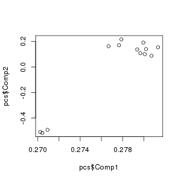

# Cookbook for making metabrainnetwork.nl

This is the cookbook for creating a website like metabrainnetwork.nl. It will go through the steps of generating the matrices that are used as input for the website backend, and how to set-up a docker installation of the webste.

##Questions or suggestions?

You can contact <...>. This manual was written by Niek de Klein.

## Following along with examples
In [example_network/](example_network/) there are all the scripts that you need to make a genenetwork using the samples from a randomly chosen, small dataset on the Europen Nucleotide Archive: [PRJNA233428](https://www.ebi.ac.uk/ena/data/view/PRJNA233428)[1](#citations). Note that a couple of hundred samples are needed at least for network creation, and this set is only used to show the code with runable examples. 

The code in this cookbook will use these samples as example data. You will need to clone or download [https://github.com/npklein/brain_eQTL](https://github.com/npklein/brain_eQTL) with `git clone https://github.com/npklein/brain_eQTL.git` and download [eqtl mapping pipeline distribution](https://molgenis50.gcc.rug.nl/jenkins/job/systemsgenetics/473/nl.systemsgenetics$eqtl-mapping-pipeline/artifact/nl.systemsgenetics/eqtl-mapping-pipeline/1.4.7-SNAPSHOT/eqtl-mapping-pipeline-1.4.7-SNAPSHOT-dist.tar.gz) as these are used in the examples.

## Manual contents

The Genenetwork creation is divided in several steps, because at the end of each step some user interaction is needed. E.g. for [1. Outlier removal](#outlier-removal) visual inspection of PCA is needed for selecting outliers, and after [2. Correlation and eigenvalue decomposition](#correlation-and-eigenvalue-decomposition), eigenvalues have to be inspected to select the correct number of eigenvectors for follow up steps.

1. [Expression tables](#expression-tables)
2. [Outlier removal](#outlier-removal)
3. [Correlation and eigenvalue decomposition](#correlation-and-eigenvalue-decomposition)
   3.1 [Slurm](#slurm) 
   3.2 [Correlation and evd steps overview](#correlation-and-evd-steps-overview) 
4. [GeneNetwork matrix creation](#genenetwork-matrix-creation) 
	4.1 [Matrix creation steps overview](#matrix-creation-steps-overview) 
5. [Docker](#docker)
6. [Ansible](#ansible)

## Expression tables
The starting point is an expression table with TPM normalized gene counts, with as rows genes and columns samples. This table can be made with many different programs.

For the [metabrain network](metabrain.nl) expression quantification was done using [kallisto](https://pachterlab.github.io/kallisto/) version 0.43.1[2](#citations). For an example of how to run kallisto and create an expression matrix, see [example_network/step1-get-expression-table.sh](example_network/step1-get-expression-table.sh). 

## Outlier removal
From the gene expression table outlier samples have to be removed. This can be done in various ways. For this cookbook we will look at principal component outliers. For the [metabrain network](metabrain.nl) we have also filtered samples with outlier QC metrics from STAR aligned BAM files. To get the PCs results on the example data, see [example_network/step2-pca-for-outlier-detection.sh](example_network/step2-pca-for-outlier-detection.sh). Note that in the example we only take the first 1000 genes of the file. The reason for this is that at a certain point a gene x gene correlation matrix is made, and eigenvalue decomposition is performed on this matrix. For an example taking all genes is too much, which is why we use this subset. For real data this subselection should not be made. 

This takes 5 steps:

1. It removes genes that:
 	- are not located chromosome 1-22, X, Y or MT 
 	- have duplicate expression as another gene
 	- have duplicated gene IDs
 	- have 0 count for all samples
2. Selects a subset of the samples based on an input files with samples to use (in the example this is all samples)
3. Removes samples with identical expression
4. Quantile normalizes the expression data
5. Calculates and plots the PCs

This will write pca.png to the output directory that you have defined in [example_network/step2-pca-for-outlier-detection.sh](example_network/step2-pca-for-outlier-detection.sh). Check if there are outliers in your output file and make a text file that contains only the samples that you want to keep. e.g. for our example dataset you could choose to only include samples pcs$Comp1 > 0.274 (see [example_network/step2-pca-for-outlier-detection.sh](example_network/step2-pca-for-outlier-detection.sh) for an `awk` example how to do that). Because of the limited sample size you can't really select outliers this way, in real data it would look more like the figure on the right. 

Example from example_network/            |  Real data
:-------------------------:|:-------------------------:
 |   

After outlier removal it is good to redo the PCA to see if there are no new outliers that were masked by the previous outliers. Move the `3_quantileNormalized` directory in your output dir to `3_quantileNormalized-first-round-pca` and `1_selectSamples` to `1_selectSamples-first-round-pca`, and rerun [example_network/step2-pca-for-outlier-detection.sh](example_network/step2-pca-for-outlier-detection.sh) with the new sample file.

## Correlation and eigenvalue decomposition
The correlation and eigenvalue decomposition is done by running [https://github.com/npklein/brain_eQTL/tree/master/GeneNetwork/step2-correlation-and-evd.sh](https://github.com/npklein/brain_eQTL/tree/master/GeneNetwork/step2-correlation-and-evd.sh). This takes as input the expression table and file of samples to use, and outputs eigenvectors, eigenvalues and pc-scores. These are used as input for [GeneNetwork matrix creation](#genenetwork-matrix-creation).

### Slurm

[example_network/step3-correlation-and-evd.sh](step3-correlation-and-evd.sh) runs [brain_eQTL/GeneNetwork/step2-correlation-and-evd.sh](https://github.com/npklein/brain_eQTL/tree/master/GeneNetwork/step2-correlation-and-evd.sh). Some of the steps in this script do some heavy computing to make correlation matrices and do evd. Where necesarry these are submitted as jobs to a slurm scheduler. If you are not running on a cluster with a slurm scheduler, you will have to change `brain_eQTL/GeneNetwork/scripts_per_step/6_CorrelationMatrix.sh` and `brain_eQTL/GeneNetwork/scripts_per_step/7_evd_on_correlation.sh`.

### Correlation and evd steps overview
[example_network/step2-GeneNetworkMatric-creation.sh](step2-GeneNetworkMatric-creation.sh) 

1. It removes genes that:
 	- are not located chromosome 1-22, X, Y or MT 
 	- have duplicate expression as another gene
 	- have duplicated gene IDs
 	- have 0 count for all samples
2. Selects a subset of the samples based on an input files with samples to use (in the example this is all samples)
3. Removes samples with identical expression
4. Does a DESeq[3](#citations)-like normalization on the expression data
5. Calculates and plots the PCs
6. Calculates gene-gene correlation matrix
7. EVD on correlation matrix and plots eigenvalues

The last step plots the first 100 eigenvalues. This can be used to select the numebr of informative eigenvectors for the next step. Typically, you want to find the PC where the variance explained is flattening. In the caes of our example data (see left picture), we use 3 eigenvectors. In case of metabrain.nl, we take 70 eigenvectors (right side). If it hasn't flattened at 100 eigenvalues yet, replot eigenvalues.txt with larger size.

Example from example_network/            |  Real data
:-------------------------:|:-------------------------:
 |   

### Command line options

All command line options are mandatory.

| Short option | Long option| Desription |
| ------------- | ------------- | ------------- |
| -e  | --expression_file | Expression file |
| -t  | --TMPDIR | Where files will be written during runtime. Handy when program crashes. |
| -p  | --project_dir| Base of the project_dir where config files will be written. |
| -o  | --output_dir| Output directory where results will be written. |
| -j  | --jardir | Location of eqtl-mapping-pipeline.jar |
| -s  | --sample_file| File with samples to include. |
| -g  | --github_dir| Location of git cloned https://github.com/npklein/brain_eQTL/ directory. |
| -z  | --covar_table | Covariate table. Expression data will be corrected for all covariates that are include. Columns are samples, rows are covariates. Expression data will be corrected for all covariates in this file. See [example_network/cov_table.txt](example_network/cov_table.txt) for an example. Any row that is in the covariate table will get removed from the expression table. You have to check your own data which technical covariates need to be removed |
| -a  | --gtf | GTF file. Has to be same genome vesion as index/ref genom that quantifcation is done one. |
| -v  | --threads | Number of threads to use for correlation step and PCA step. |
| -n  | --name | Name to put in output file names, e.g. MetaBrain will give output file MetaBrain.eigenvectors.txt.gz. |
| -h  | --help | Print program usage. |

## GeneNetwork matrix creation

The GeneNetwork matrices can be generated by running [https://github.com/npklein/brain_eQTL/tree/master/GeneNetwork/step3-backend-matrix-creation.sh](https://github.com/npklein/brain_eQTL/tree/master/GeneNetwork/step3-backend-matrix-creation.sh). This takes as input the eigenvectors and number of eigenvectors to use, and calculates co-reguation scores and different functional enrichments. The output is a set of matrices that are used as input for the backend of [metabrain.nl](metabrain.nl)/[genenetwork.nl](genenetwork.nl). See [example_network/step4-create-matrices.sh](step4-create-matrices.sh) for an example of how to run `step2-correlation-and-evd.sh`.

### Matrix creation steps overview

1. center-scales the eigenvectors
2. Correlates the eigenvectors
3. Calculates the GenNetwork predictions
4. Bonferonni corrects the prediction p-values
5. Converts matrices to the output expected by the [metabrain.nl](metabrain.nl)/[genenetwork.nl](genenetwork.nl) website. 

### Command line options

All command line options are mandatory.

| Short option | Long option| Desription |
| ------------- | ------------- | ------------- |
| -e  | --expression_file | Expression file |
| -t  | --TMPDIR | Where files will be written during runtime. Handy when program crashes. |
| -p  | --project_dir| Base of the project_dir where config files will be written. |
| -o  | --output_dir| Output directory where results will be written. |
| -j  | --jardir | Location of eqtl-mapping-pipeline.jar |
| -s  | --sample_file| File with samples to include. |
| -g  | --github_dir| Location of git cloned https://github.com/npklein/brain_eQTL/ directory. |
| -z  | --covar_table | Covariate table. Expression data will be corrected for all covariates that are include. Columns are samples, rows are covariates. Expression data will be corrected for all covariates in this file. See [example_network/cov_table.txt](example_network/cov_table.txt) for an example. Any row that is in the covariate table will get removed from the expression table. You have to check your own data which technical covariates need to be removed |
| -a  | --gtf | GTF file. Has to be same genome vesion as index/ref genom that quantifcation is done one. |
| -v  | --threads | Number of threads to use for correlation step and PCA step. |
| -d  | --gene\_network_dir | GeneNetwork directory (with backend data for predictions. |
| -n  | --name | Name to put in output file names, e.g. MetaBrain will give output file MetaBrain.eigenvectors.txt.gz. |
| -z  | --n_eigenvectors | Number of eigenvectors to use |
| -h  | --help | Print program usage. |

## Docker

To build the [metabrain network](metabrain.nl) web service we use [Docker](https://www.docker.com/)[4](#citations). 

## Ansible

To deploy the [metabrain network](metabrain.nl) we use ansible.

## citations
1. XSAnno: a framework for building ortholog models in cross-species transcriptome comparisons.
2. Bray, Nicolas L., et al. "Near-optimal probabilistic RNA-seq quantification." Nature biotechnology 34.5 (2016): 525-527.
3. Anders S, Huber W (2010). “Differential expression analysis for sequence count data.” Genome Biology, 11, R106. doi: 10.1186/gb-2010-11-10-r106, http://genomebiology.com/2010/11/10/R106/.
4. Merkel, Dirk. "Docker: lightweight linux containers for consistent development and deployment." Linux journal 2014.239 (2014): 2.

